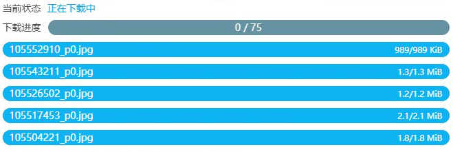

# Frequently Asked Questions

?> You can use the browser's search function `F3` (?Crtl+F?) to search for keywords on this page.

?> Watch the video tutorial: [What to do when encountering issues](https://www.youtube.com/watch?v=9LiUKk88Sfg&list=PLO2Mj4AiZzWEpN6x_lAG8mzeNyJzd478d&index=17':target=_blank')

## Check the following info

When encountering issues, please first check the following:

**Caution: If you encounter problems but your browser is not Chrome or Edge, don't contact me**

1. If you're not using Chrome or Edge, please install the extension on Chrome or Edge and check again.
2. If your Chrome or Edge browser is the latest version, please update.
3. If the extension you use is not the latest version, please update to the latest version. Current version: 
4. Restart your browser and check again.
5. There may be network connectivity issues. Please check your internet connection. Users in mainland China are recommanded to use VPN or proxy tools for stable connectivity.
6. If you're already using VPN, please ensure that the Pixiv domain `i.pximg.net` is included in proxy rules. Some VPNs may not proxy this domain by default.
7. If you're using Nginx reverse proxy to access Pixiv, consider switching to a VPN. Some reverse proxies may have slow image loading speeds, and the downloader may not be able to download images through reverse proxies.
8. Your system disk (usually C:) may be running out of space (minimum 4GB free space required). Free up and storage space and restart your browser.

## Other Questions

1. If you're not sure about how to use certain features, please refer to the relevant sections in this wiki.
2. Check the [Post-Installation Settings](./After_Insatllation) page for potential issues.
3. Review the help info on this page.
4. If the issue persists, please visit the [Contact_Info](./Contact_Info.md) page.

-------------

## Where to find downloaded files?

*File/Image location/path*

Downloaded files are saved in your browser's default download directory.

## Can files be saved outside the browser's default download directory?

**No**, due to browser limitation.

Due to browser security policies, the downloader can only save files to the browser's default download directory.

## How to modify download location

*Modify download path*

If you don't want files to be saved in the default download directory, you can only change the download folder location in your browser settings.

Open your browser's settings page and modify the download location under 'Downloads'.

You can also directly access the download settings by entering `chrome://settings/downloads` in the address bar.

If you don't want to change the browser's default download location, you'll need to manually move files after downloading.

## How to create folders

Use a forward slash `/` in the naming rule. The text before the slash will be used as the folder name.

For example, `{p_title}/{id}-{tags}-{user}` will create a folder using the page title.

## How to group an artist's works in the same folder

*How to keep one artist's works together?*

Simply use the artist's name as the folder name in the naming rule. For example:

```
{user}/{id}
```

## How to save multi-image works in separate folders

If you prefer this structure:

Single images are saved directly in the artist's folder, while multi-image works are saved in additional subfolders.

Example:

```
Downloads
│
├─ArtistName
│  │  99097921.png
│  │
│  └─99276627
│          99276627_p0.png
│          99276627_p1.png
```

First, in the naming rule, create only the artist's folder, e.g.: `{user}/{id}`.

Then enable the "Create a separate folder for each work"(More-Show advanced Settings-Name) setting with the following sub-option (this is the default setting):

```
Number of files > 1   Name {id_num}
```

This will achieve previous effect.

## No works matching filter criteria found after crawling

Sometimes after crawling, you might see this message:

```
Crawl complete but did not find works that match the filter criteria.Please check the settings related to Crawl.
```

This means none of the works met the filter criteria (or filter conditions). 
The settings you see in the "Crawl" tab, such as work type, number of images, bookmarks, publication date, tag requirements, etc.

By default, the filter doesn't exclude any works. If you modify the filter to exclude certain works, you might see this message.

## Why are there more matched files than total works?

Sometimes after crawling, you might see a message like:

```
Total works: 10
Total files: 20
```

This is because some works contain multiple images. Each image is a separate file, so it's normal to have more files than works.

## Downloaded filenames are garbled

*Filename issues/garbled filenames/uuid*

Some users might see downloaded filenames with random characters, like this:


```
7dc64752-0616-448d-99ce-4676c501b503.png
e3852d43-4a9f-4156-abda-544eff38ce3f.jpg
```

This happens when other extension modifies the downloader's filenames.

Try disabling other extensions with **download function** one by one, then use this extension to see if the issue is solved. This can help identify conflicting extensions.

Conflicting extensions are usually those that manage file downloads, such as Chrono Download Manager, or extensions for download software (like IDM browser extension), or extensions with video/image download or screenshot function.

Some **known** conflicting extensions: See the "Beware of conflicting extensions" section on the [Post-Installation Settings](zh-cn/安装之后) page.

*Technically, if an extension uses the `onDeterminingFilename` event in its code, it might conflict with the downloader.*

*The downloader doesn't use this event and doesn't affect other extensions' filenames.*

## Filenames in jfif format

*Filename extension is jfif(file ends with jfif)*

Possible reasons:
1. Affected by other extensions, as mentioned in the "Downloaded filenames are garbled" section.
2. If you selected "Thumbnail" as the image size in download settings, jfif format might be downloaded. This is normal case.

## Does it support resuming interrupted downloads?

Yes, it supports resuming interrupted downloads. If the page crashes or is closed during download, you can reopen the page to continue downloading.

## How to avoid downloading duplicate files?

How to avoid downloading works that have already been downloaded?

Enable the "Don't download duplicate files" option. See the [Don't download duplicate files](/zh-cn/设置-更多?id=不下载重复文件) section.

In some cases, you might also consider using incremental updates to avoid downloading previously downloaded files. See the "Incremental Updates" section in the "Usage Tips" page.**check the term list**

## Download too slow

What to do if downloads are slow or 0 speed?

This is an issue for users in mainland China. We recommend using reliable proxy/VPN software like SSR, V2Ray, or Clash with stable routes. Also, set the proxy rules to **global proxy**. (**Enabling global proxy can improve download speed**)

Another solution is to use the "Copy URL" function to copy image URLs and download them using software like Xunlei-torlent or IDM. However, these software can't rename files during download.

## Animated image downloads are slow

For slow animated image downloads, first refer to the previous section. Also, slow animated image downloads are normal.

1. Animated images are larger in size, so downloads will be slower.
2. Essentially, Pixiv animated images are zip files. If you select "webm", "APNG", or "gif" as the save format, the downloader will also transcode the zip file, which takes extra time.
3. The page might be obscured. See: [Keep the page unobscured when converting animated images](/zh-cn/使用技巧?id=转换动图时保持页面不被完全遮挡)

## Download progress stays at 0



Some users might encounter this issue where a single download progress bar is complete, but the total progress bar shows 0 completed and doesn't proceed to download subsequent images.

Try the following:

1. First, keep refreshing the page and restart/continue download task to check if the issue is resolved.
2. If the issue persists, it's usually because you're using the wrong browser. Some browsers are third-party Chromium derivatives with shells and can't properly use the downloader. Try Chrome or Edge.
3. If your browser meets the requirements, try restarting or updating your browser before starting the download again.
4. If the issue persists, try downloading a few works individually. If some work but others don't, it might be due to **illegal characters in the filename**. Try modifying the naming rules and download again.
5. If the issue still can't be resolved, please refer to the "Contact Me" page in this wiki to report the issue.

## 任务卡住怎么办

这一般是网络问题，网络情况越差，越容易遇到这个问题。

如果你在抓取任务时就卡住，可以尝试等待一段时间，看过一段时间之后是否能够继续抓取。如果不能，建议刷新页面重新抓取。

如果在下载时卡住，可以先暂停任务然后点击开始下载；或者关闭页面，之后再打开这个页面，继续下载。

?>如果你的网络情况比较差，可以把下载线程设置的小一些，减小卡住的几率。

## 下载卡住时会自动重试吗

会。

当网络状况较差时，下载可能会因为超时或者网络断开而卡住。本程序会自动重试下载出错的文件。

## 一直卡住，无法下载到任何图片

首先检查网络问题，如果网络没问题（可以正常访问 Pixiv，网速也很快），那么你可以检查一下系统盘（一般是 C 盘）剩余空间。

如果系统盘剩余空间比较小，Chrome 可能会阻止一些较大的 xhr 请求，导致下载一直失败。请清理一下空间再尝试下载。这个原因是由 Reinford 找出来的。

*备注：在这种情况下，Chrome 不会阻止 fetch 请求*

## 下载到的图片是损坏的

下载的图片只能显示一部分/一半，剩余部分没有图像。

这可能是下载时网络出现问题，图片加载到一半之后失败了。请重新下载损坏的图片/作品。

如果重新下载后还是损坏的，可能是这个图片存在缓存。请清除浏览器的缓存之后，刷新页面重新下载这个作品。

## 下载进度条变成红色是怎么回事

这表示这个进度条上的文件下载出现了错误，下载器会尝试重新下载它。

你不需要做出处理。

## 下载失败：USER_CANCELED

如果出现这样的错误提示，可能的原因有：

1. 下载时弹出另存为对话框
2. 文件名超长
3. 其他原因

前两条的解决方法写在下面。

## 下载时弹出另存为对话框

*下载时弹出文件另存为对话框/另存为窗口/保存窗口*

如果下载时浏览器弹出了“另存为”对话框，请检查以下可能的原因：

**原因 1**：请确认你在浏览器设置里**关闭**了“下载前询问每个文件的保存位置”。

如果开启了这个设置，那么每次下载都会出现“另存为”对话框，所以你应该关闭这个设置。

**原因 2**：可能是下载的文件里有重复的文件名，请检查你的命名规则。

如果你的命名规则里带有 `{id}` 标记或者 `{p_num}`，那么应该不会有重名文件；否则就可能有重名文件。

比如作品 id 78279423，有三张图片，`{id}` 或者 `{p_num}` 标记会添加序号，这样就不会重名：

```
78279423_p0.jpg
78279423_p1.jpg
78279423_p2.jpg
```

如果不带序号，就会重名：

```
78279423.jpg
78279423.jpg
78279423.jpg
```

当命名规则里没有 `{id}` 或者 `{p_num}`，则要留意是否会出现重名问题。

**原因 3**：可能是因为文件名过长。

一般来说，大部分操作系统的文件名长度限制是 255 个字符。如果文件名很长，字符数量超出限制，则浏览器可能无法保存文件，而是出现“另存为”对话框，让用户进行操作。

如果你是 Windows 操作系统，并且文件保存在本机硬盘上，应该不会遇到这个问题，因为在这种情况下，Chrome 会自动截断超出长度的字符，让文件能够成功保存。

但如果是其他情况，例如你使用的是某些 Linux 操作系统，或者文件的保存位置是网络位置（NAS），那么 Chrome 可能无法采取正确的措施，这会导致文件保存失败，有可能出现“另存为”对话框。

**原因 4**：可能是因为下载位置不存在

例如，你浏览器设置里的文件下载位置是 `D:\downloads`，如果这个位置不存在了，也会弹出另存为对话框。

## 文件名太长怎么办

*文件名超长/文件名太长*

如果你因为文件名超长导致无法保存文件，那么你可以打开下载器面板，在“更多”选项卡的“命名”部分，启用“文件名长度限制”。

“文件名长度限制”功能可以让你设置文件名的最大长度。如果文件名超出长度，下载器会截断多余的字符，让文件能够正常保存。

## 为什么下载后会自动打开图片

*下载后自动打开图片/自动打开文件/自动打开 txt 文件*

下载的文件默认不会自动打开。如果你发现某一类文件会在下载后自动打开，请检查你在下载此类文件时，是否在底部下载栏里勾选了“总是打开此类文件”。


如果你勾选了这个选项，就取消勾选即可。

## 为什么在搜索页面不会自动开始下载

你可以关闭“预览搜索页面的筛选结果”，并且启用“自动开始下载”，这样就可以自动开始下载了。

为什么启用了“预览搜索页面的筛选结果”就不会自动开始下载了呢？请查看这个选项的说明。

[预览搜索页面的筛选结果](zh-cn/设置-更多?id=预览搜索页面的筛选结果)

## 离线安装之后，浏览器启动时会出现提示

如果你离线安装了本程序，当浏览器启动时，可能会在右上角提示：请停止以开发者模式运行的扩展程序。


>Chrome 84 版本之后没有这个弹窗了。但是 Edge 浏览器目前还有。

如果你想消除这个提示，以下提供一些办法：

1. 如果你安装有火绒杀毒软件，你可以使用它的屏蔽弹窗功能，屏蔽这个弹窗。


注意只选择这个弹窗，不要把整个 chrome 都屏蔽了。

来源：[一届书生](https://www.cnblogs.com/52dxer/p/11067617.html ':target=_blank')

*在线安装本扩展不会出现弹窗警告。*

## Date format error!

如果启用了选项“设置投稿时间”，需要输入起始时间和结束时间。

如果输入的时间不能被解析为有效的时间，就会出现警告信息：`Date format error!`

## 无权访问某个作品

这是因为在获取某个作品时出现了无法处理的错误。

这是一个网络请求的错误，可能这个作品是私密的作品，或者只是单纯的网络问题。

你可以打开这个 id 的作品页面，如果它是正常的，你可以在这个页面直接下载它。

## 下载（抓取）按钮不显示

这可能是某些设置项的值有误，导致下载器出错。

你可以尝试打开下载面板-“更多”选项卡-管理设置-重置设置，然后刷新页面。

## 如何下载 ID 列表

如果你有作品的 id 列表，想根据 id 列表进行下载，需要打开 Pixiv 主页，然后打开下载器面板，可以看到这个按钮：

*输入id进行抓取*

点击这个按钮会出现一个输入框，把 id 列表复制进去就可以开始抓取了。

## 怎么停止抓取

怎么停止/中止/中断抓取？

目前没有控制按钮可以停止抓取。你可以刷新页面来强制停止抓取。

## 浏览器启动时卡住

Chrome很卡/卡顿/Chrome启动无响应/卡一会儿/浏览器卡顿/浏览器很卡

这可能是你的下载记录太多导致的。你可以在“清理浏览数据”界面查看下载记录的数量：


下载记录太多可能会导致浏览器卡顿，特别是浏览器刚启动时，以及打开下载管理页面时。

一般来说，如果下载记录的数量超过 10,000 个，你就可以清理了。

如果清理下载记录之后，问题依然没有解决，请考虑卸载和重装浏览器。

## 怎么分批下载

分批下载/分批抓取

在一些页数较多的页面里，如果你预计到抓取结果太多，可以考虑分批进行抓取和下载。

例如：

1. 在第 1 页，设置“抓取页数”为 100，然后开始抓取和下载。
2. 下载完成后，跳转到第 101 页，然后再次抓取 100 页。因为下载器会从当前页面开始计算页数，所以这样可以抓取 101 - 200 页。
3. 以此类推。

## 安卓系统里文件名的排序混乱

*安卓文件管理器排序错误/排序混乱/文件名排序错误/文件排序混乱*

pixiv 下载的文件是带有 id 和序号的，假设一个作品有很多张图片，并且 id 和序号在文件名的开头，像这样：

```
94495223_0
94495223_1
94495223_2
94495223_3
94495223_4
94495223_5
......
94495223_20
```

以上是序号 0 到序号 20 的示例。

我们通常希望下载下来的图片在资源管理器（文件管理器）里也能按序号排序。那么我们在资源管理器里选择“文件名”排序方式就可以了。

但是使用安卓系统的用户经常会发现他们所看到的排序是混乱的，例如（仅列出序号部分）：

```
0
1
10
11
12
13
14
15
16
17
18
19
2
20
3
4
5
6
7
8
9
```

这个问题的原因是：这个资源管理器把文件名作为字符串进行排序，结果就出现了这种情况。

如果把序号部分解析为数字再排序，就不会出现这个问题。

那么怎么解决安卓上的这个问题呢？你可以在下载器的“更多”选项卡--“命名”分类里，开启设置“**在序号前面填充 0**”。这样就能解决这个问题。

启用“在序号前面填充 0”之后，序号会变成下面这样：

```
000
001
002
003
004
005
006
007
008
009
010
011
012
013
014
015
016
017
018
019
020
```

因为在序号前面填充 0 之后，序号的长度都是一样的，所以在安卓上也能够按照正常的顺序排列了。

## 怎么让下载的文件按照网页上的顺序排序

*图片排序，作品排序，文件排序*

怎么让下载的作品保持和网页上一样的顺序呢？

在大部分页面里，作品都是按照作品 id 倒序排序的。越晚发表的作品，其 id 越大。

你在网页上看的作品排序可能是这样的：

```
96954935
96894692
96800281
96659987
96628297
```

下载器默认的命名规则会在文件名的开头使用 `{id}`。你可以让下载后的文件按照文件名排序，也就是使用作品 id 来排序。

不过资源管理器里的默认排序是正序排列的（从小到大），所以你看到的文件的顺序和网页上是相反的。如果你想让文件的顺序和网页上的一致，你可以在资源管理器里更改排序方式，让文件名倒序排列。

## 下载收藏的作品时怎么让文件按照收藏顺序排序

下载书签里的作品时，怎么让下载的文件和作品的收藏顺序一致？

之所以会有这个问题，是因为收藏/书签里的作品的排序不是按照作品 id 排序的，而是按照你收藏它的时间来排序的。

默认的，你最新收藏的作品会排在前面，最早收藏的作品会排在后面。怎么让下载后的文件按照收藏的顺序排列呢？

你可以修改命名规则，在文件名的开头使用 `{bmk_id}`，例如 `{bmk_id}-{id}`。

- `{bmk_id}` Bookmark Id。你收藏的每一个作品都会有一个 Bookmark Id。收藏的时间越晚，Bookmark Id 就越大。当你下载你的收藏时，可以使用 `{bmk_id}` 作为排序依据。

`{bmk_id}` 是一串数字，但它不是作品 id，而是你收藏这个作品时产生的一个数字。在文件名的开头使用这个数字，可以用来对文件进行排序。

不过资源管理器里的默认排序是正序排列的（从小到大），所以你看到的文件的顺序和网页上是相反的。如果你想让文件的顺序和网页上的一致，你可以在资源管理器里更改排序方式，让文件名倒序排列。

## 搜索标签时最多只能抓取 1000 页怎么办

搜索页面不能抓取所有作品怎么办？目前没有能够直接解决这个的办法，需要你多花点时间来手动解决。

有些 tag 的搜索结果很多，例如：

https://www.pixiv.net/tags/%E8%83%8C%E6%99%AF/artworks

“背景” tag 现在有 172,734 个作品。一页显示 60 个作品，总页数接近 2900 页。

但是你可能只能查看到 1000 页。当你位于第 1000 页时。底部的页码也到头了，没有后续的页码：

https://www.pixiv.net/tags/%E8%83%8C%E6%99%AF/artworks?p=1000https://www.pixiv.net/tags/%E8%83%8C%E6%99%AF/artworks?p=1000


抓取不完了，这是怎么回事呢？

1. 这是 pixiv 的限制，下载器无法破解。
2. pixiv 普通用户最多可以查看 1000 页，pixiv 高级会员最多可以查看 5000 页。
3. 你能够查看到多少页，下载器也就能下载到多少页。

**怎么解决这个问题**？以下是一些可行的方法：

- 方法 1：修改排序方式来抓取更多作品


默认情况下搜索结果的排序方式是从新到旧。你可以先正常抓取和下载 1000（或者 5000）页，下载完成之后，在第一页点击“按旧排序”，这样搜索结果的排序方式是从旧到新，这样你就能够下载到更多的作品了，最多可以下载到 2000（或者 10000）页的作品。但是如果这样还是不能下载到所有作品，那就需要考虑其他办法了。

- 方法 2：使用时间段筛选

你可以在搜索页面点击“搜索条件”，然后设置“时间”选项为“指定时间”。


例如，你可以设置时间范围为某一年，然后查看和下载这一年里发表的作品。

下载完成后，再搜索另一年里发表的作品，并下载它们。以此类推。

- 方法 3：购买 pixiv 高级会员（premium）

因为 pixiv 高级会员（premium）可以查看 5000 页，所以不容易遇到这个问题。相比之下，普通用户只能查看 1000 页，遇到这个问题的几率就比较高。

## 下载时发生错误，状态码为 0

有些用户可能会遇到下面的错误：

```
下载时发生错误，状态码为 0，请求未成功。可能的原因： 

1. 系统磁盘的剩余空间可能不足（建议剩余空间大于 4GB）。请尝试清理系统磁盘空间，然后重新启动浏览器，继续未完成的下载。 

2. 网络错误。可能是网络代理导致的问题。
```

这是因为对于下载器发出的请求，浏览器直接返回了 200 failed 状态（请求成功但返回了失败的结果。下载器内部 XHR 请求的 status 是 0）。

可能的原因以及解决方法：

1. 系统磁盘的剩余空间可能不足（建议剩余空间大于 4GB）。注意要看【系统盘】的剩余空间，而不是其他盘。如果系统盘的剩余空间小，就清理空间。
2. 网络错误。目前已知一些国内用户使用 Nginx 反代理上 p 站，或者 Apache 反代理上 p 站，有可能发生这个问题。请关闭这些反代理软件，换成使用梯子访问 p 站，就不会出现这个错误了。

## 怎么用梯子？

梯子就是俗称的翻墙软件。

目前小白很容易错误的购买一些收费的梯子（vpn）软件，但这些软件的大多是坑钱的，质量不佳。例如：蓝灯、蜂窝vpn、西部世界、猎豹加速器等。

在这些软件里，它的线路基本都是固定的一些线路，是软件开发商自己维护的。你不能换成别的机场的翻墙服务。如果这个软件自带的翻墙服务不好用，那你也没办法对它怎么样。

成熟的梯子是免费的，其软件只是一个工具，不自带翻墙功能。现在 Windows 上流行的软件是 V2rayN 和 Clash。手机上的话 Clash 似乎更方便一些。

有了梯子软件后，你需要去机场（提供翻墙服务的网站）购买翻墙服务，然后在梯子里使用。机场提供的线路不管是在数量上还是速度、稳定性上都比那些坑钱的软件更好。有些机场提供免费路线（免费的质量就差一些）。如果一个机场不好用了，你可以换成别的机场。

---------

有些新人不知道怎么用梯子，我在这里发个我现在用的梯子网站（机场）：

?>机场网址：[[TTK Cloud](https://www.ttkcloud.icu/#/register?code=6m4hMaPu)](https://www.ttkcloud.icu/#/register?code=6m4hMaPu ':target=_blank')

域名是塔塔开！ttk cloud。这个梯子我用了很久了，稳定，速度快，不易出错。

机场的使用方法是先购买流量套餐，之后获取订阅链接，最后到 ssr、v2ray、clash 里使用。网站里也有教程的，可以注册看下。

因为有很多国内用户遇到网络问题，所以在这里发一下，希望能有所帮助。

--------

很多机场的套餐一般都分包月的（到期的话就过期）或者按流量的（购买一定额度的流量，不用完就不会过期）。

这就像一些点卡游戏的月卡或者点卡一样，需要你根据自己的需求来选择。

所以如果你用的流量多，可以考虑月卡。用的流量少，就偏向于点卡。

## Pixiv 返回了空数据

当你在搜索页面进行抓取时，可能会在日志里看到提示：

```
Pixiv 返回了空数据。下载器已暂停抓取，并且会在等待几分钟后继续抓取。
```

这是因为 pixiv 最近做出了反爬取措施，如果短时间内抓取几百页，就会触发限制，pixiv 直接返回空数据，这将导致下载器什么都抓取不到。

所以当触发了这个限制之后，下载器必须等待一段时间（目前是 200 秒），等待限制解除之后再继续抓取。

## 作品总数为 0，Pixiv 可能拒绝了此次抓取

如果你在搜索页面已经被限制了抓取，此时再开始抓取，就会出现“作品数量为 0”的错误。

这是因为 pixiv 的反爬取措施导致的，请过几分钟后重试。

## 429 错误

*429 状态码*

抓取遇到429问题： 

短时间内抓取太多就会这样。 这是 pixiv 的反爬取措施，在几分钟内不能进行抓取。

即使出现了429，但是下载器依然可以抓取完毕，只是需要的时间比以前多。 

如果你不想遇到429，可以在下载器设置中启用“减慢抓取速度”。（但这会导致抓取需要更长的时间）

如果你想要最快的抓取速度，就不要开启“减慢抓取速度”，让下载器自动重试抓取即可。

## 会被封号吗

*如果下载得太多会被 ban 吗？*

如果你下载得太多，可能会收到 pixiv 的“过度访问警告”邮件，内容如下：


当你收到邮件之后，如果仍然大量下载，有可能会被 pixiv 永久封禁账户。

被封禁的账户无法收藏、点赞作品，也无法关注画师。但是仍然可以正常浏览和下载大部分内容。

如果你被封禁了，可以尝试注册新的账号。

?>下载器现在可以检测用户是否在最近收到了此信息，如果检测到，就会自动暂停下载，避免用户被封号。

## 无法打开 EPUB 文件

*无法打开 EPUB 小说；小说的 EPUB 文件损坏*

如果你在打开下载器生成的 EPUB 小说文件时出现错误，请尝试更换小说阅读器。


很显然，WPS 不是一个合适的 EPUB 阅读器。

有些软件也同样如此。


我建议你自行搜索“epub 阅读器”来找到真正适合阅读 EPUB 小说的软件。

这里是一些可以在浏览器里直接打开 EPUB 小说的网站：

https://www.neat-reader.cn/webapp#/

https://epub-reader.online/#

