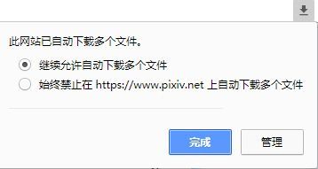
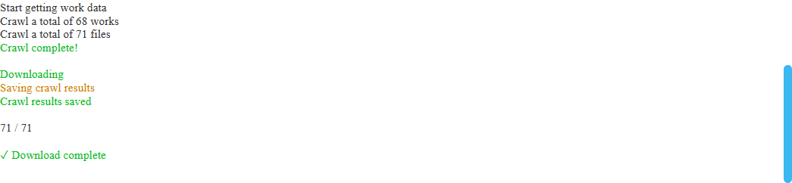
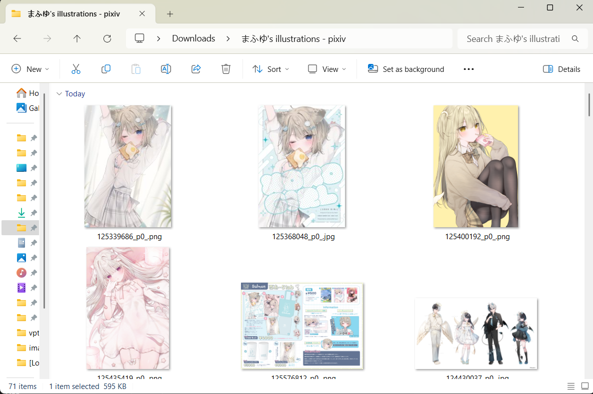

# First Download Attempt

Let's open a test page, here is [Artist Mafuyu's Works List Page](https://www.pixiv.net/member_illust.php?id=5229572&type=illust ':target=_blank'):

## Start Crawling

Open the downloader panel, then click the "Start Crawling" button, and the program will automatically start crawling the works.

After crawling is complete, under default settings, the downloader will automatically start downloading files.

?> During the first batch download, the browser may ask: Allow this site to download multiple files?

Please select Allow.

## Logs

While the program is running, it will display some simple prompts at the top of the page, including the set conditions and download progress. For example:

## Status in Title Bar

After crawling starts, the program will add some symbols before the webpage title to indicate the task status. For example:

The `[↓]` at the front indicates downloading is in progress; the following number 94 indicates the remaining number of files waiting to be downloaded.

Common statuses are as follows:

- ↑ Crawling in progress
- ↓ Downloading in progress
- √ Download complete
- ☑ Download complete, but the page URL has changed since crawling started

Some less common statuses:

- → Crawling complete, waiting for next operation (search page)
- ▶ Crawling complete, ready to start downloading (requires user to manually click "Start Download" button)
- ║ Download paused
- ■ Download stopped

## Save Location

Downloaded files are stored in the **browser's download directory**.

## Download Not Going Smoothly?

If you encounter problems during download, please refer to the [FAQ](en/FAQ) page.

If you still can't find the reason, please refer to the [Contact Me](en/Contact Me) page.